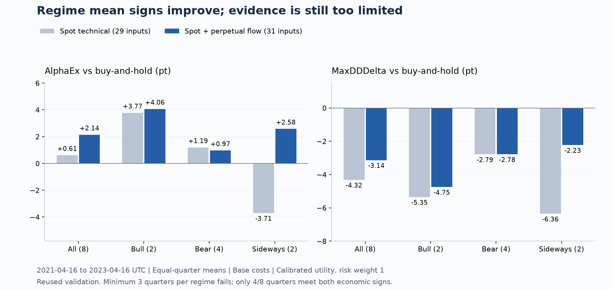

# 先物需給の追加検証 — 2026-09-05

**先物の売買需給2列を加えた補正後の配分で、今回観測した上昇・下落・横ばいの平均が、通常費用と費用2倍の両方で AlphaEx > 0 / MaxDDDelta < 0 になった。** ただし、上昇・横ばいは各2四半期しかなく、各相場3四半期という事前条件は未達である。8四半期のうち両符号を満たすのは4四半期で、経済成績の区間も0をまたぐ。最強モデルや高い汎化確率の認定はしていない。

比較条件・実装・テストを `99f3cd9` にコミットしてから学習した。[事前登録](oracle_derivative_ablation_registration_20260905.md)、[行数・欠損の事前確認](oracle_derivative_preflight_20260905.md)、[実行登録](oracle_derivative_ablation_evidence_20260905/ablation/registration.json)、[全結果](oracle_derivative_ablation_evidence_20260905/ablation/results.json)を保存した。以前の13四半期平均と、今回の8四半期平均を直接比較しない。

## 同じ期間・同じ行で確認した経済成績

対象はBTCUSDT、2021-04-16 13:45 UTC以上・2023-04-16 13:45 UTC未満の元development fold 5〜12。学習18か月、平均・分散補正3か月、区間幅校正3か月を分離した。全群の6時間判断は2,587行、将来ラベルまで揃う採点行は2,575行。予定判断2,920行から欠損条件で除外された部分がある。売買判断には将来ラベルの欠損maskを使わない。

下表は四半期を等しく重み付けした平均、単位はpt。technicalは現物の29特徴、perp2はそれに無期限先物の6時間・1日weighted flowを加えた31特徴である。いずれも補正後のリターン平均と分散を使う。

| 特徴・配分 | 通常 AlphaEx | 通常 MaxDDDelta | 費用2倍 AlphaEx | 費用2倍 MaxDDDelta |
| --- | ---: | ---: | ---: | ---: |
| technical・条件付き効用、risk 0 | +0.467 | −3.844 | +0.136 | −3.731 |
| perp2・条件付き効用、risk 0 | **+2.025** | **−2.764** | **+1.612** | **−2.636** |
| technical・条件付き効用、risk 1 | +0.613 | −4.320 | +0.294 | −4.208 |
| perp2・条件付き効用、risk 1 | **+2.144** | **−3.137** | **+1.737** | **−3.008** |
| 全8列追加・条件付き効用、risk 1 | +2.032 | −1.925 | +1.571 | −1.787 |

perp2は親モデルより平均AlphaExを増やしたが、平均DD抑制幅は小さくなった。両指標で親モデルを上回ったという意味ではない。risk 0は予測分散を使わない。risk 1とrisk 0の差は、通常でAlphaEx +0.120pt / MaxDDDelta −0.373ptだった。

perp2・risk 1の相場別平均は次のとおり。区分は四半期最初の判断時に既知の90日momentumと7日volatilityから固定し、四半期全体がその相場だったことを意味しない。

| 開始時の相場 | 四半期数 | 通常 AlphaEx | 通常 MaxDDDelta | 費用2倍 AlphaEx | 費用2倍 MaxDDDelta |
| --- | ---: | ---: | ---: | ---: | ---: |
| 上昇 | 2 | +4.063 | −4.749 | +3.777 | −4.548 |
| 下落 | 4 | +0.967 | −2.784 | +0.595 | −2.706 |
| 横ばい | 2 | +2.579 | −2.231 | +1.979 | −2.074 |

risk 0も全区分の通常・費用2倍で符号を満たした。全8列追加のrisk 1は横ばいでAlphaEx −1.781pt / DDDelta +1.082ptとなり、列を増やせば相場別の結果も良くなるわけではなかった。

perp2・risk 1の各四半期は以下。平均の符号だけでは隠れる失敗を残す。

| Fold | 通常 AlphaEx | 通常 MaxDDDelta |
| ---: | ---: | ---: |
| 5 | −6.176 | +6.505 |
| 6 | −0.142 | +2.513 |
| 7 | +14.302 | −16.003 |
| 8 | −0.469 | +2.514 |
| 9 | +6.060 | −4.258 |
| 10 | +3.131 | −7.462 |
| 11 | +1.350 | −8.699 |
| 12 | −0.901 | −0.204 |

両符号を満たすのは4/8四半期。記述的なiid fold bootstrapの区間はAlphaEx −1.482〜+6.341pt、DDDelta −8.199〜+1.418ptで、どちらも0をまたぐ。これらは選択補正後の保証区間ではない。相場別の観測符号を満たした2候補も、最低件数込みの既存ゲートでは不通過である。

### 親モデルとの差は1四半期に集中している

結果を得た後に、perp2とtechnicalのAlphaEx差を四半期ごとに分解した。補正後risk 1の全8四半期平均差は+1.531ptだが、fold 12（2023-01-16〜04-16）の寄与だけで+1.994ptある。同四半期ではtechnicalの−16.8522ptに対してperp2は−0.9015ptであり、大きな劣後を避けたことが全体差を支えている。残り7四半期の平均差は−0.529ptだった。

| 補正後の配分 | 全8四半期の平均AlphaEx差 | fold 12の全体平均への寄与 | 残り7四半期の平均差 |
| --- | ---: | ---: | ---: |
| point | +0.270 | +0.566 | −0.338 |
| utility risk 0 | +1.557 | +2.077 | −0.594 |
| utility risk 1 | +1.531 | +1.994 | −0.529 |

単位pt、perp2−technical、通常費用。費用2倍でもrisk 1の全8四半期平均差+1.443ptに対し、残り7四半期の平均差は−0.556ptとなる。これは親モデルからの改善の偏りであり、候補自身のB&Hに対するAlphaExとは区別する。改善の偏りを確認する事後診断であり、評価からfold 12を除外したり、残り期間で再選択したりしていない。登録した全8四半期の評価はそのまま残す。全foldを1つずつ外した集計と費用2倍の差も[寄与の診断JSON](oracle_derivative_ablation_evidence_20260905/contribution_diagnostic.json)に収録した。先物情報による経済改善が四半期をまたいで安定しているとは、まだ言えない。

## 予測精度に何が起きたか

各特徴群で別々のRidgeリターンモデルとHGB log分散モデルを学習した。Ridgeの正規化統計も各foldのfit区間だけから求めた。全群・raw/scaledで推論mask、採点mask、実現値、persistence基準とfit平均が一致することを独立に照合した。

下表は `100 × [1 − mean_q(L_model,q) / mean_q(L_reference,q)]`、単位は%。各Lは四半期内の平均損失で、それを四半期等重みで集計してから比を取る。四半期ごとの改善率を平均した値ではない。正が改善、負が悪化。基準の「ゼロ」は将来対数リターン0、「fit平均」はpurge済み学習行の平均リターンである。

| 特徴 | 補正 | Return MSE 対ゼロ | Return MSE 対fit平均 | 分散QLIKE 対1日持続性 |
| --- | --- | ---: | ---: | ---: |
| base16 | なし | −3.642 | −3.399 | −1.104 |
| base16 | あり | −6.496 | −6.247 | +8.994 |
| technical | なし | −4.333 | −4.089 | +0.957 |
| technical | あり | −7.029 | −6.779 | +13.748 |
| perp2 | なし | −3.858 | −3.615 | +0.131 |
| perp2 | あり | −6.171 | −5.923 | +13.278 |
| 全8列 | なし | −4.313 | −4.069 | +0.544 |
| 全8列 | あり | −6.018 | −5.770 | +14.303 |

**perp2はtechnicalよりリターンMSEが僅かに改善したが、ゼロ予測やfit平均を上回るMSEにはなっていない。** 改善幅はrawで0.456%（5/8四半期）、補正後で0.802%（6/8四半期）。補正後の相場別改善は上昇1.992%、下落0.241%、横ばい0.008%だった。一方、同じperp2のQLIKEはtechnicalよりrawで0.834%、補正後で0.545%悪化した。

横ばいの微小なリターンMSE改善は、行数重みでは0.0375%悪化に反転する。「予測精度が全相場で改善した」とは断言できない。相場別の経済平均の符号と、相場別の予測誤差は別の判定である。

平均補正は全4群でリターンMSEを悪化させたにもかかわらず、一部配分の成績を改善した。補正後の配分改善を「リターンMSE改善」や「リスク校正だけの効果」と呼ばない。risk 0のraw→scaled変化は分散を使わず、平均bias補正とその後の保有経路による。予測損失と経済目的の違いが残る。

全8列の補正後はtechnicalよりリターンMSE 0.945%、QLIKE 0.643%改善した。ただし全8列には既存spot flowと線形に重なる列や、新たに復元できるspot flow24がある。表現とRidgeの実効正則化も変わるため、全8列の改善を先物だけの情報効果とは解釈しない。主要な情報追加比較はtechnical→perp2である。

四半期等重みと行数重みは区別した。例えばbase16 rawのQLIKE対1日持続性は等重みでは1.104%悪化だが、行数重みでは0.587%改善になる。全8列rawのリターンMSE対technicalも等重み+0.019%改善、行数重み−0.250%悪化と反転した。全結果に両集計を収録している。

## 平均と分散を入れ替えた4通りの診断

追加の結果を見る前に、`64de0fe` で[組み替え条件](oracle_derivative_crossed_decisions_registration_20260905.md)を固定した。保存済みの補正後平均・分散を組み替え、同じ8四半期・同じ判断行でpointとutility risk 1を再生した。再学習や再校正はなく、費用2倍も通常費用で決めた注文系列を使った。[実行登録](oracle_derivative_ablation_evidence_20260905/crossed/registration.json)と[全結果](oracle_derivative_ablation_evidence_20260905/crossed/results.json)を保存した。

| 平均の供給元 | 分散の供給元 | 配分 | 通常 AlphaEx | 通常 DDDelta | 費用2倍 AlphaEx | 費用2倍 DDDelta |
| --- | --- | --- | ---: | ---: | ---: | ---: |
| perp2 | technical | point | −0.116 | −0.447 | −0.748 | −0.310 |
| technical | perp2 | point | −0.421 | −0.641 | −1.003 | −0.501 |
| perp2 | technical | utility risk 1 | +2.143 | −3.137 | +1.736 | −3.008 |
| technical | perp2 | utility risk 1 | +0.622 | −4.319 | +0.303 | −4.207 |

単位pt、等四半期平均。perp2の平均を保ったまま分散をtechnicalへ戻しても、元のperp2 utility risk 1（+2.144/−3.137pt）からほとんど変わらない。逆にtechnicalの平均で分散だけをperp2にすると、元のtechnical（+0.613/−4.320pt）に近い。今回の効用配分で見えた差は、主に平均予測とそれに伴う保有経路に由来する。分散QLIKEの改善をそのまま経済改善へつなげる説明は支持されなかった。

perp2平均＋technical分散のutilityは、観測した全相場の平均符号を通常・費用2倍で満たしたが、同じ2/4/2四半期の不足は残る。technical平均＋perp2分散は横ばいAlphaExが−3.648pt、費用2倍−3.977ptだった。追加4通りに新しい区間推定や選択を行っていない。これまでの候補名は合計109になったが、独立な109試行を意味しない。

## 連続期間を保った損失差の診断

予定された6時間格子にNaNの採点欠損を残し、各四半期内の連続blockを再標本化した。四半期を等重みとし、候補と基準に同じ抽出位置を使った。主設定は28判断slot＝7日、感度確認は4/112slot＝1/28日、各2,000回。これは既知の8四半期と保存済みモデルに条件付けた記述的診断である。

下表はperp2−technicalの損失差。負がperp2を支持する。区間はbootstrap平均で誤差を中心化した95%の記述的区間で、通常のbasic bootstrap区間や選択補正後の検定と同一ではない。事前登録に記載した明示的計算式に従っている。

| 損失 | 補正 | 平均差 | 7日block区間 | 1日・28日感度 |
| --- | --- | ---: | --- | --- |
| Return MSE | なし | −1.4994e−6 | [−2.7300e−6, −1.1424e−7] | どちらも負 |
| Return MSE | あり | −2.7058e−6 | [−4.0483e−6, −1.3341e−6] | どちらも負 |
| 分散QLIKE | なし | +0.004244 | [+0.002012, +0.006330] | どちらも正 |
| 分散QLIKE | あり | +0.002416 | [+0.001170, +0.003646] | どちらも正 |

全8列補正後のtechnicalに対するQLIKE改善は、7日blockでは区間全体が負だが、28日blockでは上端+0.0000953と0をまたいだ。非循環block抽出でのbootstrap平均と元平均の差も、7日で+0.001124、28日で+0.001565あり、観測差−0.002847に対して小さくない。この差には端点重みのほか、有限回の抽出と欠損による分母の変化も関わり、要因ごとには分離していない。この感度の不一致を隠さない。

全12比較×3block長×2,000回を、別実装のprefix-sum計算で再現し、最大差6.94×10⁻¹⁸だった。全四半期が揃わない無効replicateは0件。最初の2四半期の採点行は221/364、215/368にとどまる。欠損で除外された期間の成績、四半期間の依存、再学習、探索による選択、将来相場の不確実性はこの区間に含まれない。

ペア損失と系列依存を考慮する根拠は [Diebold–Mariano (1995)](https://doi.org/10.1080/07350015.1995.10524599)、block法の背景は [Künsch (1989)](https://doi.org/10.1214/aos/1176347265)。探索した多数の候補についての推論には別途扱いが必要であり、今回 [HansenのSPA検定](https://papers.ssrn.com/sol3/papers.cfm?abstract_id=264569) を実施したわけではない。固定block長が当該BTC系列で最適だとも主張しない。

## 実装と独立監査

64モデル、64予測、32校正記録、208注文系列、128判断traceを保存した。518箇所の入力・source・artifact hashを照合。全32 RidgeモデルをBLASに依存しないスカラー計算で再現し、予測差は最大3.47×10⁻¹⁸。64補正版の校正定数も再現し、9 HGBモデルでは木を1本ずつたどったlog予測の差が0だった。

108会計経路と10,968効用判断を独立に再構成し、AlphaEx差は最大2.66×10⁻¹⁵、DDDelta差5.55×10⁻¹⁶、取引数差0だった。実行時には以前と同じNumPy matmulのdivide/overflow/invalid警告が出たが、有限性検査と独立スカラー検算は通過した。警告の根本原因を解明したとは扱わず、ログを保持する。

全32 Ridgeについて学習の正規方程式もBLASに依存せず再構成し、最大残差は3.77×10⁻¹⁵だった。全64予測指標と集計の独立再計算差は最大6.66×10⁻¹⁶。[会計・予測監査](oracle_derivative_ablation_evidence_20260905/independent_audit.json)と[損失・学習監査](oracle_derivative_ablation_evidence_20260905/loss_fit_audit.json)を保存した。会計・HGB走査は指定3fold・3群の標本監査で、全保存物のhash検査とは対象範囲が異なる。

組み替え診断も別に監査した。342ハッシュ照合、96注文・48判断traceを確認し、既存64方策の結果とファイルは元の保存物に一致した。全16 point経路を再構成し、指定3foldでは24会計経路・1,828効用判断を再生した。AlphaEx差は最大1.55×10⁻¹⁵、DDDelta差5.55×10⁻¹⁶、取引数差0。[組み替え監査JSON](oracle_derivative_ablation_evidence_20260905/crossed_audit.json)に範囲と誤差を残した。

最終コードで `uv run python -m unittest discover -s tests -v` を実行し、**463 tests OK、56.801秒**。全体テストは予測や売買結果の汎化を証明するものではない。7つの原本コピーのSHA-256は[manifest](oracle_derivative_ablation_evidence_20260905/manifest.json)に記録した。図と寄与診断は結果から派生した資料である。

次に検証すべきなのは、親モデルに対する経済成績の改善が特定四半期へ集中する理由と、入力の遅延・欠損に対する安定性である。モデル構造を増やす前に、小さな比較条件を先に固定する。最低相場件数、各四半期の安定性、選択補正、未観測期間での経済成績は引き続き未達。登録済みの不通過判定や旧選択lockを変更せず、Goalを継続する。

## 全24配分の平均成績

単位pt、通常と費用2倍。対B&Hの符号条件を全体平均で満たしたのは6/24、観測相場平均でも満たしたのは2/24、相場件数込みのゲート通過は0/24。

| 候補 | 通常 AlphaEx | 通常 DDDelta | 費用2倍 AlphaEx | 費用2倍 DDDelta |
| --- | ---: | ---: | ---: | ---: |
| base16_raw_point | -1.030 | +0.584 | -1.249 | +0.626 |
| base16_raw_utility_risk0 | -1.630 | -0.732 | -1.934 | -0.621 |
| base16_raw_utility_risk1 | -1.963 | -1.060 | -2.264 | -0.945 |
| base16_scaled_point | -0.527 | -0.206 | -0.772 | -0.154 |
| base16_scaled_utility_risk0 | -0.409 | -2.928 | -0.634 | -2.843 |
| base16_scaled_utility_risk1 | -0.315 | -4.039 | -0.528 | -3.960 |
| derivative_raw_point | -0.090 | +0.572 | -0.773 | +0.723 |
| derivative_raw_utility_risk0 | +2.361 | +0.709 | +1.895 | +0.815 |
| derivative_raw_utility_risk1 | +3.194 | -0.086 | +2.707 | +0.027 |
| derivative_scaled_point | +0.123 | -0.421 | -0.606 | -0.249 |
| derivative_scaled_utility_risk0 | +2.110 | -1.503 | +1.630 | -1.364 |
| derivative_scaled_utility_risk1 | +2.032 | -1.925 | +1.571 | -1.787 |
| perp_flow_raw_point | -0.346 | +0.680 | -0.934 | +0.795 |
| perp_flow_raw_utility_risk0 | +0.974 | +0.852 | +0.517 | +0.959 |
| perp_flow_raw_utility_risk1 | +1.080 | +0.871 | +0.622 | +0.976 |
| perp_flow_scaled_point | -0.140 | -0.440 | -0.774 | -0.302 |
| perp_flow_scaled_utility_risk0 | +2.025 | -2.764 | +1.612 | -2.636 |
| perp_flow_scaled_utility_risk1 | +2.144 | -3.137 | +1.737 | -3.008 |
| technical_raw_point | -0.957 | +0.734 | -1.511 | +0.848 |
| technical_raw_utility_risk0 | -2.222 | +0.854 | -2.621 | +0.953 |
| technical_raw_utility_risk1 | -2.065 | +0.352 | -2.467 | +0.455 |
| technical_scaled_point | -0.411 | -0.630 | -0.992 | -0.491 |
| technical_scaled_utility_risk0 | +0.467 | -3.844 | +0.136 | -3.731 |
| technical_scaled_utility_risk1 | +0.613 | -4.320 | +0.294 | -4.208 |
