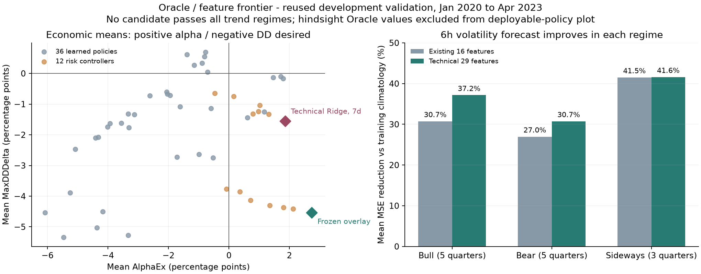

# Oracle・特徴量の探索結果 — 2026-09-05

**相場状態に依存せず AlphaEx > 0 と MaxDDDelta < 0 を満たすモデルは、ML36候補と追加のリスク制御12候補からは確認できなかった。** テクニカル特徴の追加で短期ボラティリティ予測と一部の運用指標に改善が見られたが、「最強モデル」や高い確率での汎化を示す結果ではない。

本報告は [事前登録した設計](oracle_frontier_registration_20260905.md) と、保存済みの [実行登録](oracle_frontier_evidence_20260905/oracle_frontier_v1/registration.json)、[全結果](oracle_frontier_evidence_20260905/oracle_frontier_v1/results.json)、[選択ロック](oracle_frontier_evidence_20260905/oracle_frontier_v1/selection_lock.json) に基づく。対象は既に研究で利用した開発用 validation であり、`untouched_confirmation_run=false`、`formal_p1_result=false`、`high_probability_generalization_established=false` を維持する。

## 比較条件

BTCUSDT 15分足の **2020-01-16 13:45 UTC 以上、2023-04-16 13:45 UTC 未満**を13四半期に分けた。これは各 fold の実際の validation 区間である。以前の実験の development test 区間（2020-04-16〜2023-07-16）とは開始・終了が1四半期異なるため、以前の集計値との差をそのまま改善量にはできない。`fold_anchor=2020-04-16` は今回の validation 開始日ではない。

学習は各 validation の前2年に限定し、未来ラベルの終端が validation 開始に達する学習行を除外した。特徴量は意思決定時点 t の前、t−1 までを使用し、欠損を埋めずに完全な15分格子と99.5%以上の観測条件を適用した。特徴量は base16（16列）、technical（29列）、flow（24列）。比較対象は固定パラメータの Ridge / HGB、6時間・1日・7日の予測期間、return / downside の配分ルールを組み合わせた36候補である。

ML候補の判断は共通の有効特徴量行かつ6時間ごとの時点に限定した。約定は次足始値、片道費用5.5 bps、借入費用年率10%、1回の変更上限0.08、deadband 0.01。ストレス条件は売買・借入費用をともに2倍にし、同じ判断系列を再生した。全系列をB&Hと同じ初期保有量1で始める。

以下の経済指標は**四半期ごとの差の単純平均、単位はパーセントポイント（pt）**。AlphaEx は戦略の期間リターン − B&Hの期間リターン、MaxDDDelta は戦略の最大ドローダウン − B&Hの最大ドローダウンである。年率換算や13四半期を連結した運用成績ではない。

## 実行可能なモデルと未来情報の診断

| 系列 | 通常 AlphaEx | 通常 MaxDDDelta | 費用2倍 AlphaEx | 費用2倍 MaxDDDelta |
| --- | ---: | ---: | ---: | ---: |
| ML perfect・1日・downside | +46.333 | −11.357 | +44.536 | −11.271 |
| RL hindsight・beam32・risk0 | +60.633 | −14.395 | +58.244 | −14.250 |
| 凍結済み robust overlay・既存の判断時点 | +2.741 | −4.532 | +2.283 | −4.435 |
| 凍結済み robust overlay・ML共通の判断時点 | +1.627 | −2.528 | +1.209 | −2.430 |
| base16・Ridge・7日・downside | +0.617 | −1.436 | +0.122 | −1.372 |
| technical・Ridge・7日・downside | +1.861 | −1.550 | +1.266 | −1.473 |
| 固定順位1位：flow・HGB・6時間・return | −0.588 | −1.134 | −1.438 | −1.000 |

ML perfect は将来の正解値を固定済み配分ルールに入力する診断で、予測誤差がなくなった場合の参考値である。RL hindsight は将来価格を見て行動系列を探索する**計画器であり、学習済みRLモデルではない**。beam幅32の有限探索で得た実行可能な系列なので、探索目的 `log(最終NAV) − risk × MaxDD` の最適値に対する**下界**である。大域的な上限・厳密な最適解は計算していない。どちらも将来情報を使うため配備できず、学習教師・モデル選択・ライブ判断には使用していない。

未来情報を使えば改善する余地は見えるが、その余地を実際に予測できる証明にはならない。価格・行動・費用を固定した真の完全情報上限を、テクニカル指標の追加で引き上げることはできない。今回調べたのは、利用可能な情報からその参考値に近づけるかである。

robust overlay の2行は同じ凍結済みルールだが、利用する判断時点が異なる。MLとの差を評価するときは共通の判断時点の行を使う。既存の判断時点で得た成績を、MLの特徴量改善の効果として扱わない。

## 改善した部分と満たせなかった条件

通常・費用2倍の両方で平均 AlphaEx > 0 / 平均 MaxDDDelta < 0 を満たしたML候補は**6/36**で、すべて7日予測のRidgeだった。相場区分ごとにも両方向を満たした候補は**0/36**。区分は四半期最初の判断時点で既知の90日モメンタムと7日ボラティリティから固定し、上昇5四半期・下落5四半期・横ばい3四半期に分かれた。四半期中ずっと同じ相場だった、という分類ではない。

technical・Ridge・7日・downside は、base16 の対応候補より通常の平均 AlphaEx が約+1.245 pt、MaxDDDelta が約−0.113 pt改善した。ただし、上昇区分の MaxDDDelta は **+1.565 pt**、横ばい区分の AlphaEx は **−2.705 pt**。通常条件でAlphaExが正だったのは7/13四半期、DDが改善したのは6/13四半期であり、全体平均の改善を相場非依存の改善とは呼べない。全体の記述的95%区間も AlphaEx [−2.344, +6.728] pt、MaxDDDelta [−3.987, +0.624] pt とゼロをまたぐ。この四半期bootstrapは探索の選択効果や時系列依存を補正していない。

事前固定の順位は、3相場区分と2費用条件それぞれの `平均AlphaEx` と `−平均MaxDDDelta` の最悪値を最大化する。その結果、`flow_hgb_h24_return` が [探索上の確認候補としてロック](oracle_frontier_evidence_20260905/oracle_frontier_v1/selection_lock.json) された。これは「全候補の最悪区分での不足が相対的に小さい」という順位であり、通常・費用2倍とも全体AlphaExが負なので、ユーザーの条件自体を満たしていない。平均が好ましかった週次Ridgeに順位規則を後から変更していない。

予測の改善も目的変数ごとに異なる。MSE skill は学習期間の平均値予測を基準とする `1 − モデルMSE / 基準MSE` を四半期で平均した値であり、正なら基準より良い。

| 対応比較：base16 → technical | base16 | technical | 読み取れること |
| --- | ---: | ---: | --- |
| HGB・6時間のボラティリティ MSE skill | 31.77% | 35.71% | 13四半期中10四半期で改善 |
| 同・上昇区分 | 30.74% | 37.15% | 区分平均は改善 |
| 同・下落区分 | 26.96% | 30.73% | 区分平均は改善 |
| 同・横ばい区分 | 41.51% | 41.60% | 区分平均は小幅改善 |
| HGB・6時間のリターン MSE skill | −2.72% | −2.80% | 改善せず、学習平均予測にも届かない |
| Ridge・7日のリターン順位IC | 0.1627 | 0.1319 | 運用指標が改善した比較でも順位精度は低下 |
| Ridge・7日のリターン MSE skill | −14.99% | −16.95% | リターン予測誤差も改善しない |

したがって、**短期のリスク量予測には改善方向の証拠があるが、予測精度全般が向上したとはいえない**。予測指標と費用込みの判断結果を両方測る必要がある。

## 検証と次の実験

最終統合時の全体テストは410件成功。未来変更・切り詰め不変性、欠損処理、学習ラベル終端の除外、同一会計でのOracle再生などを確認した。独立監査では全234 fitのハッシュと全117 Ridgeモデルの保存予測と、うち27モデルの係数の独立再計算を確認し、保存済み予測と `einsum` 再計算の最大差は0だった。52会計経路の独立再生でもAlphaEx差は最大1.55×10⁻¹⁵、MaxDDDelta差は最大1.44×10⁻¹⁵だった。テスト成功は実装の検証であり、未観測相場での経済性能の証明ではない。保存結果には53系列 × 13四半期 = 689件の運用評価と、234件の予測評価があり、失敗候補も残した。

追加で、改善の見えたリスク量予測を配分制御に接続する12候補を [別途事前登録](oracle_frontier_evidence_20260905/oracle_risk_controller_v1/registration.json) して比較した。この [追加結果](oracle_frontier_evidence_20260905/oracle_risk_controller_v1/results.json) でも全相場区分の条件を満たした候補は0/12だった。technicalの週次予測に強度0.25のリスク制御を加えた系列は、通常 +1.312 / −1.328 pt、費用2倍 +0.559 / −1.229 ptで、上表の制御追加前に対して平均指標は改善しなかった。v1の選択ロックは維持し、追加比較の全候補はリンク先の保存JSONに残した。短期リスク予測の改善だけでは、その配分への接続方法まで改善するとは限らない。

設計に利用した一次資料は登録文書に記載したものに限定する。[Brown & Smith](https://pubsonline.informs.org/doi/10.1287/mnsc.1110.1377) は完全情報の境界と実行可能方策を区別する背景、[Elmachtoub & Grigas](https://arxiv.org/abs/1710.08005) は予測誤差と判断誤差を分ける背景として参照した。[Binance公式仕様](https://github.com/binance/binance-public-data) の出来高・取引件数・taker-buy量を利用した特徴は板の不均衡指標ではない。[Giacomini & White](https://escholarship.org/uc/item/5jk0j5jh) と [White](https://onlinelibrary.wiley.com/doi/10.1111/1468-0262.00152) は条件別評価と多数探索の扱いを考える背景であり、本実験がそれらの統計検定やSPO+を実装・再現したという主張はしていない。

再実行境界と未達の作業は [Goal継続メモ](oracle_frontier_continuation_20260905.md)、独立検証の詳細は [監査記録](oracle_frontier_evidence_20260905/audit.md) に保存した。
