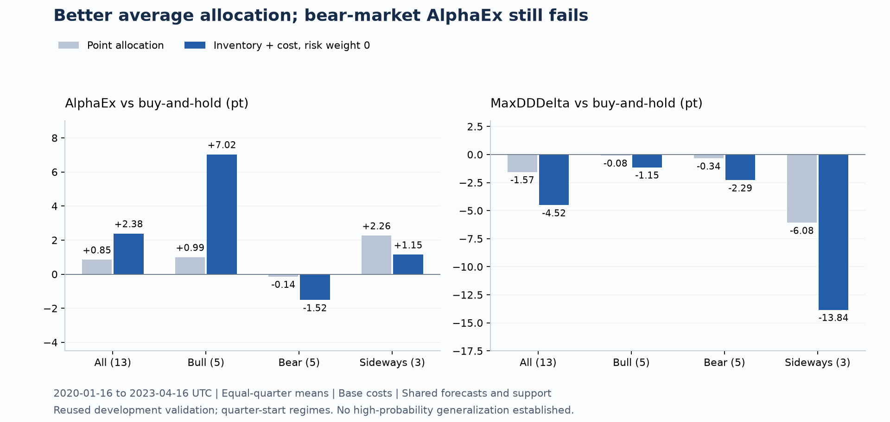

# リスク予測の信頼性確認 — 2026-09-05

**短期リスク予測の平均損失と、保有量・費用を考慮した配分の平均成績は改善したが、全相場の条件を通過したモデルはまだない。** 既存の6時間先HGBリスク予測は、過去の実現変動を持続させる基準に対しても平均損失が小さかった。ただし横ばい区分の分散MSEには悪化が残る。続く校正・配分検証では平均AlphaExとDDDeltaが改善する例を得たものの、下落時のAlphaExが負だった。今回の診断から運用モデルを採用していない。

比較条件は [事前登録文書](oracle_risk_baselines_registration_20260905.md) と設定・実装・テストをコミット `65a1d4f` に固定してから実行した。証拠は [実行登録](oracle_risk_reliability_evidence_20260905/oracle_risk_baselines_v1/registration.json) と [全結果](oracle_risk_reliability_evidence_20260905/oracle_risk_baselines_v1/results.json)。選ばなかった系列、不利な相場区分、改善しなかった比較も全結果に残している。

## 持続性基準との比較

対象は前回と同じBTCUSDT、2020-01-16 13:45 UTC以上・2023-04-16 13:45 UTC未満の13四半期である。base16 / technical / flow の既存HGB・24本先予測を再学習せずに比較した。

基準は直近24 / 96 / 672本、すなわち6時間・1日・7日の二乗対数リターンの平均を24倍して、将来6時間の分散を予測するもの。その平方根をRMS予測とする。各基準は t−1 以前の価格だけを使用し、窓全長と99.5%以上の有限リターンを要求する。欠損足を埋めたり、欠損の前後をつなぐリターンを作ったりしない。

全6系列で**同じ3,863評価行**を使用した。前回HGBの有効評価行から追加脱落はなかった。上昇は5四半期・1,419行、下落は5四半期・1,539行、横ばいは3四半期・905行。相場区分は四半期開始時に既知だった情報から固定した。各四半期末を越えて観測されるラベルは除外し、保存済み判断mask・評価mask・実現値と再計算値の一致も確認した。

以下は `1 − モデル損失の四半期平均 / 基準損失の四半期平均`。**正の値が損失減少率（%）**であり、リターン改善率や学習期間平均に対する従来のMSE skillではない。

| HGB特徴群 | 持続性基準 | 分散MSE減少 | QLIKE減少 | RMS MSE減少 |
| --- | --- | ---: | ---: | ---: |
| base16 | 24本 | 33.67% | 37.57% | 26.91% |
| base16 | 96本 | 5.76% | 5.77% | 8.22% |
| base16 | 672本 | 12.69% | 6.47% | 19.46% |
| technical | 24本 | 36.63% | 42.36% | 32.27% |
| technical | 96本 | 9.97% | 13.01% | 14.95% |
| technical | 672本 | 16.58% | 13.65% | 25.37% |
| flow | 24本 | 34.54% | 39.65% | 28.45% |
| flow | 96本 | 7.00% | 8.92% | 10.16% |
| flow | 672本 | 13.83% | 9.59% | 21.17% |

technicalの96本基準との比較では、3損失とも11/13四半期で改善した。24本基準には各13/13四半期、672本基準には分散MSEで12/13、QLIKEで11/13、RMS MSEで13/13四半期の改善だった。

## 相場区分と集計方法に残る差

technicalを96本基準と比較すると、相場別の四半期平均は次のとおり。

| 相場区分 | 分散MSE減少 | QLIKE減少 | RMS MSE減少 |
| --- | ---: | ---: | ---: |
| 上昇 | 10.39% | 11.69% | 16.21% |
| 下落 | 14.88% | 13.93% | 17.91% |
| 横ばい | **−0.70%** | 12.96% | 7.58% |

横ばいの分散MSEは2/3四半期で改善したものの、四半期平均では0.70%悪化した。評価行数で重み付けしたプール平均では1.29%改善するため、集計方法も区別する必要がある。結果JSONには両方を保存した。base16も横ばいの分散MSEが96本基準より3.28%悪く、上昇のQLIKEは8.08%悪かった。flowは同じ比較で横ばいの分散MSEが1.76%、上昇のQLIKEが1.87%悪かった。全体平均だけで相場非依存の優位を結論付けない。

## RMSの二乗を分散として評価する際の意味

元のHGBは将来の平方根実現変動をMSEで学習したモデルである。ここではそのRMS点予測を二乗して分散点予測として評価した。一般に `E[RMS | X]^2` と `E[RMS^2 | X]` は等しくないので、今回の好ましい損失だけでは分散専用学習や分散校正の正しさは示せない。

主比較の分散MSEは `mean((実現RMS² − 予測RMS²)²)`、QLIKEは `mean(y/p − log(y/p) − 1)` とした。`y=max(実現RMS², 1e-12)`、`p=max(予測RMS², 1e-12)` で、欠損を微小値に置き換えてはいない。元評価との対応用にRMS MSEも併記した。

分散上のMSEとQLIKEを選ぶ背景には、ノイズを含む変動の代理変数を使う比較について論じた [Patton (2011), Volatility forecast comparison using imperfect volatility proxies](https://public.econ.duke.edu/~ap172/Patton_vol_proxies_JoE_2011.pdf) がある。同論文の頑健性には代理変数の条件付き不偏性などの仮定がある。本BTC15分データの実現変動や微小床を設けた損失について、その条件を検証したわけではない。論文は損失選択の根拠であり、本データでの順位不変性や将来精度の保証ではない。

## 学習・補正・区間校正を分けた検証

[別登録](oracle_risk_calibration_registration_20260905.md) により、各四半期の前を学習18か月、平均・分散補正3か月、区間幅校正3か月に分けた。すべての境界でラベル終了時刻を除外した。6時間先ラベルは判断から6時間15分後に確定するため、6時間後の判断時点ではまだ利用できない。validation中の校正器は固定した。[登録・実行証跡](oracle_risk_reliability_evidence_20260905/oracle_risk_calibration_v1/registration.json) と [全結果](oracle_risk_reliability_evidence_20260905/oracle_risk_calibration_v1/results.json) を保存した。

今回はlog実現分散を予測し、補正区間で `c=mean(実現分散/予測分散)` を固定する分散校正も検証した。6方式の分散予測に共通のtechnical Ridgeによるリターン平均を組み合わせた。scaled版はリターン平均のbias補正も含む。単一の分散倍率は正規化残差の区間幅校正で相殺されるため、区間や売買の変化を分散校正だけの効果とは解釈しない。

| 分散予測 | QLIKE | リターン区間の実測coverage | 平均リターン区間幅 | 変動幅区間の実測coverage |
| --- | ---: | ---: | ---: | ---: |
| 1日持続性・未補正 | 0.5024 | 90.57% | 6.175% | 89.23% |
| HAR型Ridge・未補正 | 0.5480 | 90.50% | 5.606% | 89.46% |
| HAR型Ridge・補正後 | **0.4273** | 90.64% | 5.690% | 88.86% |
| technical HGB・未補正 | 0.5142 | 90.45% | 5.537% | 88.47% |
| technical HGB・補正後 | 0.4382 | 90.27% | 5.590% | **87.77%** |

すべて90%を狙った区間で、幅は対数リターン単位×100の四半期平均である。technical補正後のQLIKEと分散MSEは改善したが、RMS MSEは悪化した。変動幅区間のcoverageも改善せず、下落区分では **78.77%** だった。全体のリターンcoverageが約90%でも、相場ごとのリスク区間を十分に校正できたことにはならない。依存性のある時系列で、分割と有限標本quantile補正だけによる厳密な条件付きcoverage保証も主張しない。[依存データのconformal研究](https://proceedings.mlr.press/v75/chernozhukov18a.html)

同じ予測から24配分候補を評価した。technical HGBの点予測配分は、未補正の `AlphaEx −0.925 / DDDelta +0.666 pt` から補正後 `+0.849 / −1.568 pt` に改善した。補正後の費用2倍は `+0.218 / −1.471 pt`。しかし下落区分のAlphaExは通常−0.144pt・費用2倍−0.780ptで、上昇区分のDDDeltaも費用2倍では+0.021ptとなる。全区分を通過した候補は0/24だった。

90%リターン区間全体が所定の費用を上回ったときだけ注文するgateは、technical HGBでは取引0件、AlphaEx=DDDelta=0だった。これは良好な投資結果ではなく、当該区間の幅に対して予測平均が小さすぎるという診断である。HARの補正後gateは2取引のみでAlphaExは僅かに負だった。coverageを確保することと、コストを越える予測可能なedgeを得ることは異なる。

52モデル・156予測・338経済評価を独立監査し、モデル・予測・targetと入力ソースのhashを確認した。全156予測の指標再計算差は最大3.65×10⁻¹³。3foldで校正bias・scale・quantileが再現し、独立cash/units会計12回の最大差は2.91×10⁻¹⁴だった。

## 保有量と費用を考慮した意思決定

続いて [9候補を固定](oracle_conditional_decision_registration_20260905.md) し、同じ校正済み予測を使って、現在のcash/units、予測平均、予測分散、取引費用から保有継続に対する6時間の近似効用差を計算した。正の差がある場合だけ注文する。学習済みRLや大域的MaxDD最適化ではない。実装・設定・テストを `b56551d` にコミットしてから実行した。

| 分散予測 | リスク回避係数 | AlphaEx | MaxDDDelta | 費用2倍 AlphaEx | 費用2倍 MaxDDDelta | 全13四半期の取引数 |
| --- | ---: | ---: | ---: | ---: | ---: | ---: |
| base16 HGB | 0 | +2.382 | −4.516 | +1.947 | −4.444 | 531 |
| base16 HGB | 1 | +1.690 | −4.795 | +1.266 | −4.726 | 522 |
| base16 HGB | 4 | −6.681 | −7.196 | −7.007 | −7.149 | 622 |
| technical HGB | 0 | +2.382 | −4.516 | +1.947 | −4.444 | 531 |
| technical HGB | 1 | +1.731 | −4.812 | +1.299 | −4.744 | 526 |
| technical HGB | 4 | −6.467 | −7.320 | −6.813 | −7.255 | 622 |
| HAR型Ridge | 0 | +2.382 | −4.516 | +1.947 | −4.444 | 531 |
| HAR型Ridge | 1 | +1.637 | −4.795 | +1.209 | −4.725 | 533 |
| HAR型Ridge | 4 | −5.518 | −6.798 | −5.876 | −6.736 | 647 |

指標は四半期平均・pt。係数0では分散を使わず、予測平均も共通なので3名称の注文は同一である。9候補を9個の独立した改善とは数えない。係数0の全期間turnoverは38.378で、technical点予測配分の112.676から65.94%減った。取引数は2,786から531。保有量を無視した点予測配分からの改善であり、risk HGBを追加した効果ではない。

その係数0も、上昇では `+7.025 / −1.145 pt`、横ばいでは `+1.145 / −13.840 pt` だった一方、下落では `−1.518 / −2.293 pt` だった。費用2倍の下落AlphaExは−1.918pt。**全相場の符号条件を通過した候補は0/9**。全体AlphaExの記述的fold bootstrap区間も約−2.88〜+7.52ptと0をまたぐ。これは選択補正や時系列依存を処理した保証区間ではない。

係数4はDDを大きく抑えるものの、B&Hに対するAlphaExを損なった。係数0〜1の平均改善から「リスクを強く罰すればさらに良くなる」とは言えない。保存した117注文系列は、生成時の会計と既存の正規cash/unitsリプレイが全軌跡で一致した。通常費用で決定した注文意図を費用2倍で再生しており、費用2倍で意思決定からやり直した結果ではない。[実行登録](oracle_risk_reliability_evidence_20260905/oracle_conditional_decision_v1/registration.json)・[全結果](oracle_risk_reliability_evidence_20260905/oracle_conditional_decision_v1/results.json)

別担当の独立Python監査でも、4ソース・39入力予測・117注文系列のhashを照合した。fold 0/6/12の27方策・費用2条件の54会計経路と6,876判断で、注文の最大差3.44×10⁻¹⁴、効用score差2.54×10⁻¹⁷、AlphaEx差1.20×10⁻¹³、DDDelta差1.25×10⁻¹⁴、取引数差0だった。サンプル内の欠損closeも将来情報を使わず処理できた。実サンプルに欠損openによる未約定はなく、その場合は合成テストで検証した。

## 次に調べる情報と取得済みデータ

Binance公式のUSDⓈ-M先物15分足を、取得条件のコミット `83f72a1` 後にダウンロードした。2019年9月〜2023年4月の44か月を固定要求し、2020年1月〜2023年4月の40か月を公式SHA-256と照合した。初期4か月の404は欠損として保存し、前後から補完していない。グリッド128,448行のうち観測行は116,736行。2023-04-16 13:45 UTCより前に利用可能な観測足は115,350行で、4月ファイルの残り1,386行は特徴量利用対象外である。[取得登録](oracle_risk_reliability_evidence_20260905/derivative_acquisition/registration.json)・[取得台帳](oracle_risk_reliability_evidence_20260905/derivative_acquisition/source_ledger.jsonl)

保存時刻は足の開始時刻で、特徴量は確定済み足から一度だけ遅延させる。現物と先物のtaker売買代金、出来高、価格差を同時刻で比較する準備ができた。過去の配信遅延・収集時刻は未取得なので、バックテスト時刻の因果性と実運用でのデータ到着保証は区別する。現時点でこの先物データを使ったモデルの成績は測っていない。

この取得形式とchecksumは [Binanceの公式仕様](https://github.com/binance/binance-public-data) に対応する。需給差を調べる根拠として確認した [Silantyev (2019)](https://link.springer.com/article/10.1007/s42521-019-00007-w) は、BitMEXのtrade flowによる**同時期の価格変化の説明**を示している。6時間先のOOS利益を実証したものではないので、新特徴量の有効性は未検証の仮説として比較する。

モデルを動かす前に、先物と現物の差を表す8列について [利用可能行数を検査](oracle_risk_reliability_evidence_20260905/derivative_preflight.json) した。18か月学習・3か月補正・3か月区間校正の512/64/64行条件を満たすのはfold 5〜12、2021年4月以降の8四半期だった。最初の6時間先学習・補正・校正は800/233/279行。上昇2・下落4・横ばい2四半期となり、既存の各相場3四半期という条件には届かない。これは予測に情報が加わるかを調べるための比較であり、相場非依存性の最終判定には使えない。新特徴量のモデル学習・成績算出はまだ実行していない。

## 再現性と結論の範囲

当該モジュールの9テストが成功した。元の6ソース、データ証明、39予測NPZ、39モデルファイルのハッシュを照合済み。全11,589個の持続性予測を過去価格だけの独立スカラー計算で検算し、最大差は4.22×10⁻¹⁵だった。各四半期の行別予測・実現値・損失・共通maskを保存し、全13ファイルのハッシュと損失再集計も確認した。

全変更後の `python -m unittest discover -s tests -v` は **436 tests / OK**、56.154秒で完了した。これはコードの検証であり、投資上の条件通過を意味しない。

確認できたのは、再利用した開発データにおける短期リスク予測の平均損失改善と、一部配分の平均成績改善である。この診断は運用成績、依存性を考慮した有意差、選択補正後の優位性、未知の相場での一般化確率を算出していない。持続性比較の `ranking_performed=false`、`selection_performed=false` と、各段階の非正式・汎化未確立の扱いを維持する。今回の33配分候補も全相場条件は0件で、前回の48候補と合わせて81候補名称を探索済み。ただし係数0の重複などがあり、独立な81試行ではない。既存の選択lockを好結果に差し替えていない。
